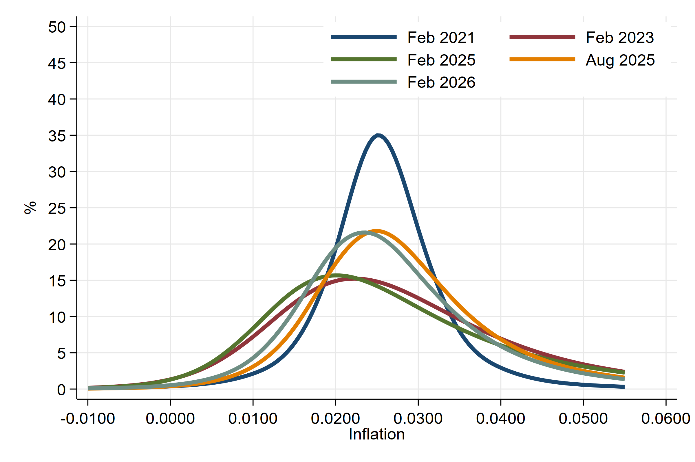
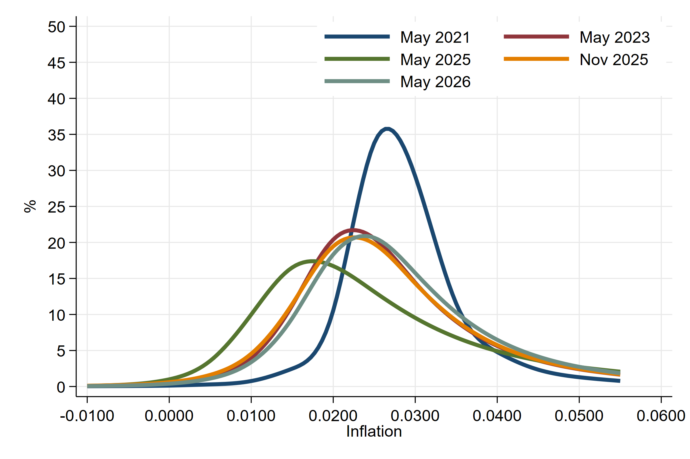
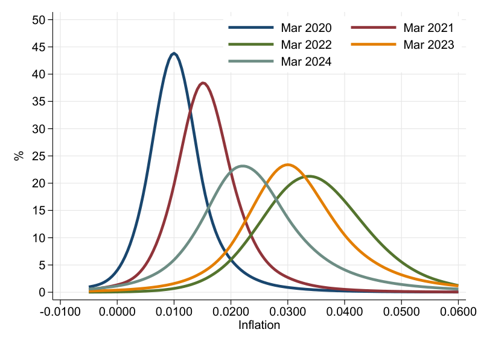
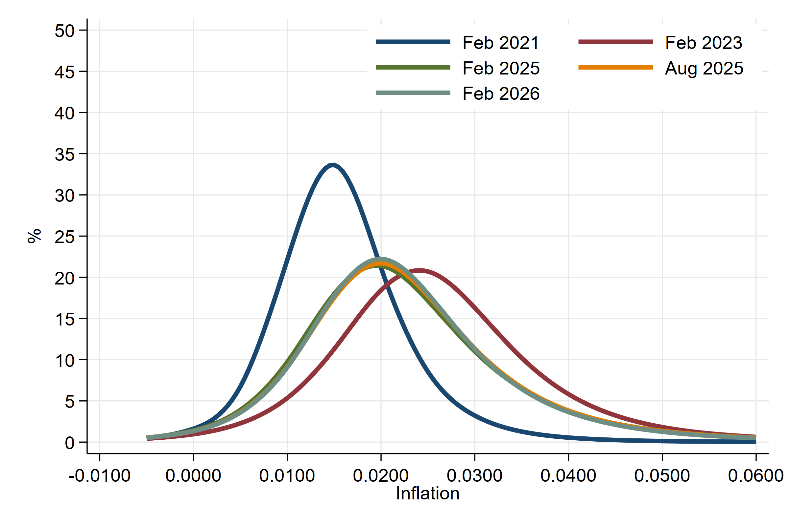

.
# Summary
The prices of inflation options at different strike prices give the cost of insuring against different realisations of inflation. They reveal the **full probability distribution of future inflation** as perceived by market participants. Hilscher, Raviv and Reis (2025) derive simple formulas to back out the probabilities from the prices that crucially take into account the erosion of the option payoff when inflation is higher than expected. They also describe an approach to use the sometimes-noisy price quotes in this sometimes-illiquid market to come up with reliable monthly estimates. This page reports monthly risk-neutral probability densities of average future inflation at the 5- and 10-year horizons, starting in October 2009 (US) / January 2010 (Euro Area). This dataset can be **freely used** by other researchers.

Related: Using these probability distributions, one can adjust for horizon and for risk compensation, to get actual probability densities for inflation disasters at forward dates and horizons,like 5-years forward, 5-years after. See: [Dataset with Probabilities of Inflation Disasters from Options Prices](https://r2rsquaredlse.github.io/web-inflationdisasters/)

The dataset will be updated regularly to reflect the latest data.
- **Vintage 1:** The dataset was first released in May 2026 to cover densities until February 2026.
- **Vintage 2:** The dataset was updated in May 2026 to cover probabilities until April 2026.

---

# Authors and Reference:
[How Likely Is an Inflation Disaster?](https://doi.org/10.1093/rfs/hhaf058) (2025), Review of Financial Studies,  hhaf058, October. 
[bibtex](25-infdis-bib.bib)
- [Jens Hilscher](https://hilscher.ucdavis.edu)
- [Alon Raviv](https://mba.biu.ac.il/en/raviv)
- [Ricardo Reis](https://www.r2rsquared.com/)
- Acknowledgments: Daniel Albuquerque, Marina Feliciano, Seyed Mahdi Hosseini, Rui Sousa, Nicholas Tokay, and Borui Zhu provided excellent research assistance.

---

# Probability densities
For each region and horizon at each month, the dataset gives the estimated **risk-neutral density** (Q-measure) of average annualized inflation over the horizon, sampled at **21 support points** (every 0.5 percentage point from −3% to +7%). These include risk compensation; they would coincide with actual probabilities if investors were risk neutral.

Each series is available in four formats — Stata, Excel, comma-separated, and a PDF figure of the latest snapshot.

| Region & horizon | Stata | Excel | CSV | PDF |
|---|---|---|---|---|
| United States, 5-year  | [.dta](data/US_5y_dens.dta)  | [.xlsx](data/US_5y_dens.xlsx)  | [.csv](data/US_5y_dens.csv)  | [.pdf](figures/US_5y_dens.pdf)  |
| United States, 10-year | [.dta](data/US_10y_dens.dta) | [.xlsx](data/US_10y_dens.xlsx) | [.csv](data/US_10y_dens.csv) | [.pdf](figures/US_10y_dens.pdf) |
| Euro Area, 5-year      | [.dta](data/EZ_5y_dens.dta)  | [.xlsx](data/EZ_5y_dens.xlsx)  | [.csv](data/EZ_5y_dens.csv)  | [.pdf](figures/EZ_5y_dens.pdf)  |
| Euro Area, 10-year     | [.dta](data/EZ_10y_dens.dta) | [.xlsx](data/EZ_10y_dens.xlsx) | [.csv](data/EZ_10y_dens.csv) | [.pdf](figures/EZ_10y_dens.pdf) |

---

# Variables
Each file is a long-format time series with three columns.

<table>
  <tr style="background-color: #d4f4d3;">
    <th style="border: 2px solid #68b684; padding: 8px;">Column</th>
    <th style="border: 2px solid #68b684; padding: 8px;">Description</th>
  </tr>
  <tr style="background-color: #f5f5f5;">
    <td style="border: 2px solid #68b684; padding: 8px;"><code>date</code></td>
    <td style="border: 2px solid #68b684; padding: 8px;">Snapshot date (YYYY-MM-DD)</td>
  </tr>
  <tr style="background-color: #d4f4d3;">
    <td style="border: 2px solid #68b684; padding: 8px;"><code>support</code></td>
    <td style="border: 2px solid #68b684; padding: 8px;">Inflation support point (annualized, decimal). Range: −0.03 to 0.07 in 0.005 steps (21 values)</td>
  </tr>
  <tr style="background-color: #f5f5f5;">
    <td style="border: 2px solid #68b684; padding: 8px;"><code>frequency</code></td>
    <td style="border: 2px solid #68b684; padding: 8px;">Estimated density at <code>(date, support)</code></td>
  </tr>
</table>

---

# Latest Figures

## United States, 5-year horizon

Risk-neutral probability densities for US inflation averaged over the next 5 years, shown at selected snapshot dates.

---

## United States, 10-year horizon

Risk-neutral probability densities for US inflation averaged over the next 10 years, shown at selected snapshot dates.

---

## Euro Area, 5-year horizon

Risk-neutral probability densities for Euro Area inflation averaged over the next 5 years, shown at selected snapshot dates.

---

## Euro Area, 10-year horizon

Risk-neutral probability densities for Euro Area inflation averaged over the next 10 years, shown at selected snapshot dates.

---

# Usage
Please cite if used, and e-mail the authors with suggested corrections.
